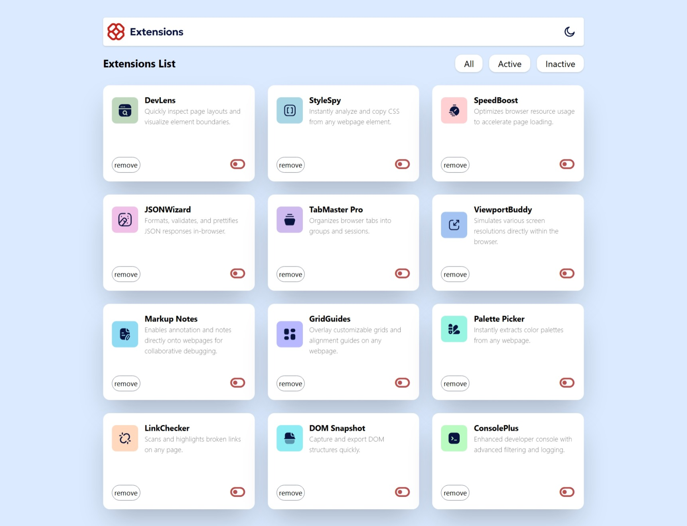

# Frontend Mentor - Browser extensions manager UI solution

This is a solution to the [Browser extensions manager UI challenge on Frontend Mentor](https://www.frontendmentor.io/challenges/browser-extension-manager-ui-yNZnOfsMAp). Frontend Mentor challenges help you improve your coding skills by building realistic projects.

## Table of contents

- [Overview](#overview)
  - [The challenge](#the-challenge)
  - [Screenshot](#screenshot)
  - [Links](#links)
  - [Built with](#built-with)
  - [Continued development](#continued-development)
  - [Useful resources](#useful-resources)
- [Author](#author)
- [Acknowledgments](#acknowledgments)


## Overview

### The challenge

Users should be able to:

- Toggle extensions between active and inactive states
- Filter active and inactive extensions
- Remove extensions from the list
- Select their color theme
- View the optimal layout for the interface depending on their device's screen size
- See hover and focus states for all interactive elements on the page

### Screenshot



Add a screenshot of your solution. The easiest way to do this is to use Firefox to view your project, right-click the page and select "Take a Screenshot". You can choose either a full-height screenshot or a cropped one based on how long the page is. If it's very long, it might be best to crop it.

Alternatively, you can use a tool like [FireShot](https://getfireshot.com/) to take the screenshot. FireShot has a free option, so you don't need to purchase it.

Then crop/optimize/edit your image however you like, add it to your project, and update the file path in the image above.

**Note: Delete this note and the paragraphs above when you add your screenshot. If you prefer not to add a screenshot, feel free to remove this entire section.**

### Links
- Live Site URL: [View Live Project](https://your-live-site-url.com)

### Built with

- Semantic HTML5 markup
- CSS custom properties
- Tailwind CSS - Utility-first CSS framework
- Flexbox and CSS Grid
- Vanilla JavaScript (ES6+)
- Font Awesome icons (v7.0.1)
- Mobile-first responsive design


#### 1. **DOM Manipulation & Event Handling**

I learned to efficiently manage multiple event listeners for filtering and toggling extension states. Using `addEventListener` to dynamically update the DOM based on user interactions.

```js
themeToggle.addEventListener("click", () => {
  document.body.classList.toggle("dark-mode");
  let isDarkMode = document.body.classList.contains("dark-mode");
  themeToggle.setAttribute("aria-pressed", isDarkMode);
});
```

#### 2. **Tailwind CSS Implementation**

Leveraged Tailwind CSS utility classes for responsive design, managing multiple breakpoints (mobile, tablet, desktop), and creating a cohesive design system without writing custom CSS.

```html
<section
  class="mt-6 grid lg:grid-cols-3 md:grid-cols-2 grid-cols-1 gap-6"></section>
```

#### 3. **Theme Toggle with CSS Classes**

Implemented a dark mode toggle that dynamically applies CSS classes, changing the entire application theme. This taught me the power of using CSS classes for state management.

```css
.dark-mode {
  background: linear-gradient(
    180deg,
    rgba(0, 0, 0, 1) 33%,
    rgba(24, 5, 133, 1) 99%
  );
  color: #f7fafc;
}
```

#### 4. **Semantic HTML & Accessibility**

Used semantic HTML5 elements and ARIA attributes for better accessibility:

- Proper heading hierarchy
- ARIA labels and pressed states
- Semantic button and section elements
- Alt text for images

#### 5. **Managing Component State**

Worked with arrays of objects to represent extension data and learned how to filter and display data based on user selections (All, Active, Inactive).

#### Areas for Enhancement:

1. **Component Reusability** - Refactor the extension card template into a reusable component/function to reduce code duplication
2. **Persistent Storage** - Implement localStorage to save user preferences (theme, filter state, removed extensions)
3. **Advanced Filtering** - Add multi-select filtering, search functionality, and sorting options
4. **Animations** - Add smooth transitions and animations for theme switching and extension toggling
5. **Performance Optimization** - Implement virtual scrolling for large lists of extensions
6. **Testing** - Add unit tests for filtering logic and event handlers using Jest or Vitest
7. **TypeScript Migration** - Convert to TypeScript for better type safety and developer experience
8. **Accessibility Improvements** - Add keyboard navigation support and screen reader announcements for dynamic content updates

### Useful resources

- [Tailwind CSS Documentation](https://tailwindcss.com/docs) - Comprehensive guide for utility-first CSS framework, essential for styling this project
- [MDN Web Docs - DOM Manipulation](https://developer.mozilla.org/en-US/docs/Learn/JavaScript/Client-side_web_APIs/Manipulating_documents) - Helped me understand dynamic DOM updates and event listeners
- [Frontend Mentor](https://www.frontendmentor.io/) - The original challenge that provided design files and requirements
- [CSS Grid & Flexbox](https://css-tricks.com/snippets/css/a-guide-to-flexbox/) - CSS-Tricks guide for layout patterns used in responsive design
- [Web Accessibility Guidelines (WCAG)](https://www.w3.org/WAI/WCAG21/quickref/) - Reference for ARIA attributes and semantic HTML best practices
- [JavaScript Event Handling](https://developer.mozilla.org/en-US/docs/Learn/JavaScript/Building_blocks/Events) - Essential for understanding event delegation and listener patterns

## Author
- GitHub - [daniel-17mg](https://www.github.com/daniel-17mg)

## Acknowledgments

This project was completed as a Frontend Mentor challenge. Special thanks to:

- **Frontend Mentor** for providing well-designed challenges that help developers improve their skills
- The open-source community, particularly the Tailwind CSS team for creating such a powerful utility-first CSS framework
- All developers who share knowledge and resources online, making learning accessible to everyone
